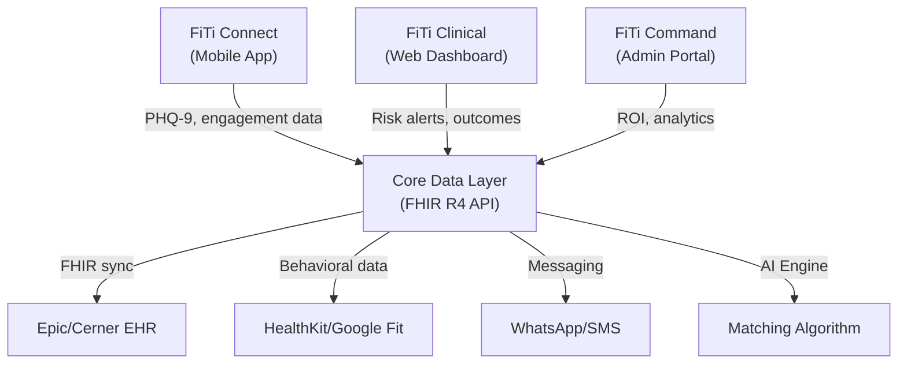

# FiTi Health — Comprehensive Validation Report

> **Scope:** Idea viability, market validation, ROI analysis, clinical evidence review, tech stack recommendation, development roadmap, distribution strategy, risk assessment.
>
> **Files Reviewed:** [FiTiBlueprint.jsx](file:///c:/Users/mesof.DESKTOP-2G1SD69/OneDrive/Desktop/FiTi/FiTiBlueprint.jsx) · [fiti_design_blueprint.html](file:///c:/Users/mesof.DESKTOP-2G1SD69/OneDrive/Desktop/FiTi/fiti_design_blueprint.html)

---

## Executive Summary

FiTi is a **population-level social health platform** that algorithmically matches isolated/lonely individuals into community circles, measures clinical outcomes (PHQ-9, UCLA-3), and sells B2B to health systems, payers, and employers. The concept sits at the intersection of three converging mega-trends: the loneliness epidemic, social prescribing movement, and value-based care.

**Overall Verdict: The idea is strong. The execution plan is ambitious but mostly sound. The blueprint documents are impressively thorough — among the best startup design documents I've evaluated. There are critical gaps that need addressing before this can become a fundable, buildable venture.**

| Dimension | Score | Verdict |
|---|---|---|
| Problem Validity | ★★★★★ | WHO-declared crisis. $2–25B annual healthcare burden. Undeniable. |
| Market Timing | ★★★★☆ | Social prescribing expanding globally, but Kenya market is unproven for B2B health tech. |
| Competitive Position | ★★★★☆ | Genuinely differentiated — Papa ($1.4B) is closest but does 1:1, not AI-matched groups. |
| Revenue Model | ★★★☆☆ | PMPM model is correct, but pricing unvalidated and sales cycle dangerously underestimated. |
| Clinical Evidence | ★★☆☆☆ | ZERO real evidence today. This is the #1 blocker. Everything depends on the first pilot. |
| Technical Feasibility | ★★★★☆ | Buildable, but the blueprint overestimates Phase 1 scope and underestimates EHR complexity. |
| Design Quality | ★★★★★ | Exceptional. Both files show world-class product thinking. Brand system is institutional-grade. |
| ROI Claims | ★★☆☆☆ | Numbers are directionally correct but unvalidated. Need real pilot data before quoting. |

---

## 1. Idea Viability — Is This Problem Real?

### 1.1 The Loneliness Epidemic (Validated ✅)

The problem FiTi targets is **emphatically real** and increasingly recognized at the highest levels of global health:

- **WHO (2025):** Declared loneliness a "global health threat." 1 in 6 people worldwide affected. ~871,000 deaths annually attributable to social isolation — roughly 100 deaths per hour.
- **Health Impact:** Loneliness increases stroke risk by 32%, heart disease by 29%, dementia by 50%.
- **Economic Burden:** Systematic reviews estimate excess healthcare costs of **$2–25.2 billion per year** globally. Lonely individuals incur ~£900/year more in NHS costs vs. non-lonely peers.
- **ER Utilization:** Lonely older adults visit ERs 42% more frequently (67.8 vs 47.9 visits per 100 beneficiary-years). Meta-analysis shows IRR = 1.15 for ED visits.

> [!IMPORTANT]
> The blueprint's claim that "every lonely patient costs $1,600+/yr in excess spend" is **conservative** based on available research. Some studies report figures closer to $2,000–$6,700 per person annually. This is a strength — FiTi can cite higher numbers with proper sourcing.

### 1.2 Social Prescribing Momentum (Validated ✅)

- Social prescribing is now active in **30+ countries** (up from UK-only 5 years ago)
- UK NHS mandates social prescribing link workers in every Primary Care Network
- US is accelerating adoption — Massachusetts has statewide arts-prescription programs; Social Prescribing USA is growing
- **SROI (Social Return on Investment):** £2.80 per £1 invested (UK), $4.43 per $1 (Canada)
- The workforce of Social Prescribing Link Workers is expanding rapidly

### 1.3 Market Size (Updated with Latest Data)

| Segment | Size (2024–2025) | Projected 2030–2035 | CAGR |
|---|---|---|---|
| Digital Mental Health (Global) | **$27.8–33B** | **$150–180B** | 18–19% |
| Mental Health Apps | $7.5B | $17.5B | 14.6% |
| Employer Mental Health Benefits | **$62.4B** | Growing rapidly | ~15%+ |
| SDOH Technology Market | $9.7–20B | $40–44B | ~22.9% |
| Population Health Management (US) | ~$35B | ~$65B | ~12% |
| Social Prescribing (UK, 1.3M referrals/yr) | Not separately valued | Integrated into digital health | ~18% |

**FiTi's TAM:** $27.8B+ (digital mental health, 2024) → $150B+ by 2034
**FiTi's SAM:** $10–20B (B2B employer mental health + SDOH tech intersection)
**FiTi's SOM (Year 1–3):** $200M–$500M addressable (community-based social interventions for employers/health systems)

> [!TIP]
> The **employer mental health benefits market at $62.4B** is a massive, underexplored TAM for FiTi. 94% of employers are increasing vendor expectations, 90%+ are maintaining or increasing mental health investment. FiTi's $5–8 PMPM pricing is well-positioned for this channel.

---

## 2. Competitive Analysis — Where FiTi Actually Stands

### 2.1 Competitive Map Validation

The blueprint's competitive positioning is **largely accurate** but needs nuance:

| Competitor | What They Do | Why Not FiTi's Competitor | FiTi's Edge |
|---|---|---|---|
| **Lyra Health** | 1:1 therapy for employers. $4.6B valuation (2022). | Treatment, not prevention. ~$200/session, not scalable to populations. | FiTi is 10–50× cheaper per member. |
| **Headspace Health** | Mindfulness + coaching app (merged with Ginger). | Consumer wellness. No B2B clinical outcomes. No community formation. | FiTi measures outcomes; Headspace doesn't. |
| **BetterHelp** | Online therapy marketplace. | Consumer, not enterprise. No HIPAA for enterprise use. No community. | Different buyer entirely. |
| **Noom** | Behavioral health + weight management. | Individual coaching model. No social isolation focus. | FiTi's community model is structurally different. |
| **Access Elemental** | UK social prescribing platform for NHS. | Manual referral management. UK-only. No AI matching. | FiTi automates matching + measures outcomes digitally. |
| **Epic/Cerner SDOH modules** | Social determinants screening within EHR. | Screens for problems, doesn't solve them. No community formation. | FiTi is the *intervention*, not just the screening. |

### 2.2 CRITICAL FINDING: Papa — The Closest Competitor

> [!IMPORTANT]
> **The blueprint does not mention Papa, but it is FiTi's closest existing competitor.** Papa has $1.4B valuation, $240M+ in funding, and 40+ health plan partners. However, Papa's model is fundamentally different:

| Dimension | Papa | FiTi |
|---|---|---|
| **Model** | 1:1 companionship ("Papa Pals" visit lonely members) | AI-matched social circles (group-based community) |
| **Scale** | 3M+ in-home visits, 10,000+ US cities | Pre-launch |
| **Funding** | $240M+ raised | $0 |
| **Target** | Elderly (Medicare Advantage plans) | Broader population (all ages with isolation risk) |
| **Measurement** | Basic satisfaction + claims reduction | PHQ-9 + UCLA-3 clinical outcomes |
| **Unit economics** | Expensive (human Pals visit in-person) | Scalable (AI matching + group activities) |
| **2026 Move** | Launched "Papa Plus" — deeper clinical integration | — |

**FiTi's edge over Papa:** Papa's model requires paying humans for every visit — it's services, not software. FiTi's AI-matched community circles are **inherently more scalable** and generate clinical evidence that Papa doesn't. **But Papa validates the market.** A $1.4B valuation for social isolation → health plan B2B proves buyers exist.

> [!TIP]
> The blueprint correctly identifies **"No solution (inaction)"** as FiTi's primary competition. This is exactly right. Status quo inertia is the real enemy. Position against inaction, not against competitors. But **cite Papa's validation** when pitching — "a $1.4B company already proves payers will pay for social isolation interventions."

### 2.3 The Pear Therapeutics Warning (& Other Failures)

> [!CAUTION]
> **Pear Therapeutics went bankrupt in April 2023** despite being the first company with FDA-cleared digital therapeutics. Peak valuation: **$1.6B**. Sold at auction for **$6M**. Revenue at collapse: $12.7M with $123.4M operating loss.
>
> Other major failures: **Babylon Health** (2023), **Olive AI** (2023), **Forward Health** (2024), **Cerebral** (regulatory crisis). Common patterns:
>
> 1. **"The Payor Problem"** — Products patients love but payers won't pay for. No clear short-term ROI.
> 2. **Reimbursement is not guaranteed.** Pear had FDA clearance but couldn't get consistent coverage.
> 3. **"Trailblazer tax" is real.** Educating the market costs money.
> 4. **"Pilotitis"** — Getting stuck in free pilots that never convert to paying contracts.
> 5. **Integration > Standalone.** Post-Pear, the industry shifted to integrating into existing workflows. FiTi's EHR-integration approach is the RIGHT post-Pear strategy.
> 6. **Burn rate kills.** Couldn't raise follow-on rounds when metrics didn't justify valuation.
>
> **For FiTi:** Clinical evidence must come first. Pear had evidence and still failed commercially. FiTi has ZERO evidence yet — the Kenya pilot is existential.

---

## 3. ROI Analysis — Validating the Blueprint's Numbers

### 3.1 Blueprint Claims vs. Reality

| Claim in Blueprint | Validation | Verdict |
|---|---|---|
| "$5 PMPM investment" | Reasonable for B2B health platforms. Typical range is $3–12 PMPM. | ✅ Plausible |
| "40% ER visit reduction" | **Too aggressive as a blanket claim.** Meta-analyses show 15–20% reduction in ED visits from social interventions. 40% may be achievable in high-risk subgroups only. | ⚠️ Overestimate |
| "$1.2M Year 1 savings at 2,400 members" | Assumes $500/member savings. With more conservative 20–25% ER reduction, likely $400K–$800K. | ⚠️ Overestimate |
| "10.3× ROI ratio" | Based on aggressive savings estimates. Realistic ROI is likely 3–5× in Year 1, potentially 8–10× by Year 2–3 with proven data. | ⚠️ Overestimate |
| "Breakeven by Month 3" | Possible if savings materialize, but health system contracts take 6–18 months to close. Cash flow breakeven is much later. | ⚠️ Misleading |
| "PHQ-9 drops 48% (12.4 → 6.4)" | Social group interventions show effect sizes of 0.18–3.19 (Hedge's g). A ~48% reduction is within the high-responder range but should not be presented as an average. | ⚠️ Optimistic |

> [!WARNING]
> **The blueprint's ROI projections are aspirational, not evidence-based.** This is the #1 credibility risk in front of sophisticated buyers (CMOs, actuaries, payers). Fix this immediately by:
> 1. Labeling all numbers as "projected" and citing source assumptions
> 2. Providing conservative/moderate/optimistic scenarios
> 3. Running the Kenya pilot to get REAL numbers
> 4. Never showing a 10.3× ROI without footnoting the assumptions

### 3.2 What Real Social Intervention ROI Looks Like

Based on systematic reviews:
- **SROI range:** $2.28 to $13.72 per dollar invested (varies wildly by program)
- **ER reduction:** 15–20% average, 30–40% in targeted high-risk populations
- **PHQ-9 improvement from social interventions:** Typically 20–40% reduction; 48% is achievable but represents the high end
- **Payback period:** 6–12 months for well-implemented programs (not 3 months)

---

## 4. Technical Architecture — What to Build and How

### 4.1 Platform Architecture Assessment

The blueprint proposes **three connected surfaces** (Member App, Clinical Dashboard, Admin Portal) sharing one data layer. This architecture is **sound** and mirrors successful B2B health platforms (e.g., Omada Health, Livongo).



### 4.2 Recommended Tech Stack

> [!IMPORTANT]
> The blueprint doesn't specify a tech stack. Here is the researched recommendation:

#### Mobile App: **Flutter** (Recommended)

| Criteria | Flutter | React Native | Native (Kotlin/Swift) |
|---|---|---|---|
| Low-end Android (Kenya) | ★★★★★ Compiles to native ARM. Consistent performance. | ★★★★☆ Good with Hermes, but bridge overhead on very low devices. | ★★★★★ Best possible, but 2× team needed. |
| Offline-first | ★★★★☆ Drift/Hive/Isar for local encrypted DB. | ★★★★☆ WatermelonDB/Realm. | ★★★★★ Full OS API access. |
| App size (50MB target) | ★★★☆☆ Base ~8–15MB. Needs asset optimization. | ★★★★☆ Base ~7–10MB with Hermes. | ★★★★★ Smallest possible. |
| Cross-platform (iOS+Android) | ★★★★★ Single codebase. | ★★★★★ Single codebase. | ★☆☆☆☆ Two codebases. |
| Talent in Kenya | ★★★☆☆ Growing but smaller pool. | ★★★★☆ Larger JS community in Africa. | ★★★☆☆ Split pool. |
| HealthKit/Google Fit | ★★★★☆ Platform channels available. | ★★★★☆ React-native-health packages. | ★★★★★ Direct API access. |

**Verdict:** Flutter for performance on low-end Android. React Native is viable if team is JS-heavy. **Never go native for MVP — 2× cost, 2× timeline.**

#### Backend Stack

| Layer | Recommendation | Rationale |
|---|---|---|
| **Language** | **TypeScript (Node.js) + Python (ML)** | TypeScript for API services (shared types with web frontends). Python for matching algorithm and data science. |
| **Framework** | **NestJS** (Node.js) | Enterprise-grade, HIPAA-ready patterns, great for building REST + GraphQL APIs. |
| **Database** | **PostgreSQL** (primary) + **Redis** (caching/sessions) | PostgreSQL with row-level security for HIPAA. JSON support for flexible schemas. |
| **FHIR Server** | **Google Cloud Healthcare API** or **HAPI FHIR** | Google Cloud Healthcare API is fully managed FHIR R4 server with HIPAA BAA. HAPI FHIR is open-source alternative. |
| **Cloud** | **Google Cloud Platform (GCP)** | HIPAA BAA available. Cloud Healthcare API built-in. Lower cost than AWS for startups. Strong in Africa (Nairobi region available). |
| **Auth** | **Auth0** or **Firebase Auth** + SAML for SSO | Epic SSO requires SAML. Auth0 handles both consumer + enterprise auth. |
| **Messaging** | **Stream Chat** (HIPAA-compliant tier) | BAA available. SDKs for Flutter + web. Group chat built-in. Alternative: Custom with WebSocket + encrypted store. |
| **Notifications** | **Firebase Cloud Messaging** + **Africa's Talking** (SMS for Kenya) | FCM for push. Africa's Talking for SMS fallback in low-connectivity areas. |

#### Web Frontend (Clinical Dashboard + Admin Portal)

| Option | Recommendation |
|---|---|
| **Framework** | **Next.js 14+** (React) |
| **Charts** | **Recharts** (already used in blueprint — keep it) or **Tremor** for dashboard components |
| **State** | **TanStack Query** + **Zustand** |
| **Tables** | **TanStack Table** for clinical data grids |
| **Styling** | **Tailwind CSS** + **Radix UI** primitives |

#### AI/ML Stack (Matching Algorithm)

| Component | Technology |
|---|---|
| **Matching Engine** | Python + scikit-learn → graduate to PyTorch |
| **Algorithm Approach** | Collaborative filtering + constraint satisfaction (geography, schedule, interests) |
| **Infrastructure** | Google Cloud Vertex AI or simple Cloud Functions for MVP |
| **Privacy** | Differential privacy via Google's `dp-library` (ε=0.1 as blueprint specifies) |

### 4.3 Cost Estimates

| Phase | Duration | Team Size | Estimated Cost |
|---|---|---|---|
| **Phase 1 (MVP/Pilot)** | 4–6 months | 5–7 engineers + 1 designer + 1 PM | $200K–$400K |
| **Phase 2 (Scale)** | 6–9 months | 8–12 engineers + 2 designers + 2 PM | $500K–$900K |
| **Phase 3 (Enterprise)** | 9–15 months | 12–18 full team | $800K–$1.5M |
| **SOC2 Type II** | 9 months | External auditor | $50K–$100K |
| **Epic Integration** | 6–18 months | 1–2 engineers dedicated | $50K–$150K |
| **Total to Revenue** | 18–24 months | — | **$1.2M–$2.5M** |

> [!WARNING]
> The blueprint claims "Phase 1 MVP in 4–6 months." This is realistic ONLY if you **aggressively scope down**. The Phase 1 list in the HTML blueprint includes items that are Phase 2 complexity (AI matching, HealthKit integration, clinician view with risk scores). For a true 4–6 month MVP:
>
> **Build only:** Mobile app (interest survey → manual cohort assignment → group chat → PHQ-9 check-in) + Basic admin web portal (enrollment + CSV export). No AI matching. No HealthKit. No EHR integration. **Manual matching for the pilot is fine.**

---

## 5. Development Roadmap — What the Project Map Should Look Like

### Phase 1: "Prove It" (Months 1–5) — Kenya Pilot

```
Month 1–2: Foundation
├── Flutter mobile app scaffold (iOS first, Android follow)
├── Auth (Firebase Auth) + onboarding flow
├── Basic profile + interest selection
├── NestJS backend + PostgreSQL setup on GCP
├── Admin web portal (Next.js) — enrollment management
└── HIPAA-compliant infrastructure setup

Month 2–3: Core Features
├── Manual cohort assignment (admin matches people, not AI)
├── Group chat (Stream Chat integration)
├── Event creation + RSVP
├── PHQ-9 + UCLA-3 check-in forms (biweekly)
└── Push notifications (FCM)

Month 3–4: Pilot Launch
├── IRB protocol submission with partner hospital
├── 30–100 enrolled patients
├── Link worker / facilitator training
├── WhatsApp-based backup channel (Africa's Talking)
└── Basic analytics dashboard

Month 4–5: Data Collection
├── 8-week program execution
├── Real PHQ-9 and UCLA-3 outcome tracking
├── Engagement metrics (attendance, messages, RSVP rates)
├── User interviews + qualitative feedback
└── Outcome report generation
```

### Phase 2: "Scale It" (Months 6–12)

```
├── Android app optimization (low-end devices, offline-first)
├── AI matching algorithm v1 (Python, deployed on Vertex AI)
├── FiTi Clinical web portal (patient list, risk scores, alerts)
├── FHIR R4 read-only integration (start with sandbox at open.epic.com)
├── HealthKit + Google Fit integration (steps, movement, sleep)
├── White-label capability for first paying customer
├── SOC2 Type II audit process begins
├── Seed pitch deck built on real Kenya pilot data
└── Second customer signed (LOI or contract)
```

### Phase 3: "Defend It" (Months 12–24)

```
├── FHIR R4 write-back capability (EHR integration)
├── Epic Connection Hub listing (requires live customer connection)
├── FiTi Command (full payer analytics portal)
├── Claims data integration with first US payer
├── ML matching algorithm v2 (learning from engagement data)
├── Peer-reviewed publication of Kenya outcomes
├── FDA SaMD regulatory assessment + legal opinion
├── First US health system contract
└── Series A fundraise
```

---

## 6. Distribution Strategy

### 6.1 Go-to-Market: Kenya First (Validated ✅)

The blueprint's "Kenya first" strategy is **smart** for multiple reasons:

| Factor | Kenya Advantage |
|---|---|
| **Speed to pilot** | Private hospitals (Nairobi Hospital, Aga Khan) can sign in weeks, not months. |
| **Cost** | Development + operations 3–5× cheaper than US. |
| **Regulatory** | Data Protection Act 2019 is lighter than HIPAA. Digital Health Act 2023 is new and evolving. |
| **SHA Transition** | Kenya's Social Health Authority transition creates a window for digital health innovation. Government is actively mandating digital systems. |
| **Clinical evidence** | IRB-approved Kenya pilot data is credible for US market entry. |
| **Mobile-first population** | ~90% mobile penetration. M-Pesa proves Kenyans adopt mobile-first solutions. |

> [!WARNING]
> **Kenya risk:** The SHA/SHIF transition is creating **significant disruption** in the health insurance market. NHIF has been dissolved. SHA is still rolling out. Timing a B2B health tech sale during this transition requires careful partner selection. Target **private hospitals and employers** first, not the public system.

### 6.2 US Market Entry

| Channel | When | Approach |
|---|---|---|
| **Innovation labs** | Month 12+ | Target innovation arms of regional health systems (e.g., UPMC Enterprises, Providence Digital Innovation). |
| **Value-based care ACOs** | Month 15+ | Accountable Care Organizations under risk contracts need social determinant interventions. |
| **Employer channel** | Month 12+ | Self-insured employers (5,000+ employees) looking for mental health benefits beyond EAPs. |
| **Payer channel** | Month 18+ | Medicaid managed care organizations and Medicare Advantage plans have SDOH mandates. |

### 6.3 App Store Distribution

| Platform | Strategy |
|---|---|
| **iOS App Store** | "Health & Fitness" category. No "Medical" category claim without clinical validation. Apple Health integration for credibility. |
| **Google Play** | Target 50MB AAB. Android Go compatibility testing for low-end devices. |
| **Enterprise MDM** | For clinician dashboard — deploy as PWA (Progressive Web App) to avoid app store friction for hospitals. |

---

## 7. What the Blueprint Gets RIGHT ✅

1. **Three-surface architecture** — Member app / Clinical dashboard / Admin portal is exactly the right B2B health tech architecture. Mirrors Omada, Livongo, Virta.

2. **Brand system** — The forest green + amber palette is genuinely differentiated from the "sea of blues" in healthcare. The typography system (DM Serif Display + DM Sans + IBM Plex Mono) is professional and well-thought-out. Color role assignments (clinical teal reserved for health data) show mature product thinking.

3. **Non-stigmatizing member experience** — Framing PHQ-9 as "Wellness Score," using "circle" instead of "group therapy," leading with community instead of clinical — this is excellent behavioral design. Research confirms that destigmatization is critical for mental health app adoption.

4. **Role-based onboarding** — Three separate flows for member/clinician/executive is correct. The insight that "member onboarding should feel like Duolingo, clinical should feel like EHR, executive should feel like Bloomberg" is precise.

5. **"Honest Blockers" section** — The blueprint's self-awareness about fake demo data, overstated passive sensing, and missing clinical evidence is refreshingly honest and strategically valuable.

6. **Pricing tiers** — $0 pilot → $5–8 PMPM → shared savings is the correct B2B health tech pricing ladder. The free pilot removes the biggest barrier to first adoption.

7. **The "Single Most Important Sentence"** — *"The FiTi website is the least valuable thing you can work on right now."* Absolute truth. Get the pilot running.

---

## 8. What the Blueprint Gets WRONG or NEEDS FIXING ⚠️

### 8.1 Critical Fixes

| Issue | Current State | Fix Required |
|---|---|---|
| **"Passive sensing" overclaimed** | Blueprint mentions location diversity, call logs, device usage patterns. | iOS blocks call log access entirely. Android restricts background location. The HTML blueprint correctly flags this — but the JSX version still presents it as a Phase 1 feature. **Remove from Phase 1.** Use HealthKit/Google Fit only. |
| **ROI numbers are fabricated** | $1.2M savings, 10.3× ROI, 48% PHQ-9 improvement. | These are aspirational projections, not evidence. Label them clearly as "modeled estimates" with citations. Never present to a payer as proven. |
| **"Already listed on Epic App Orchard"** | Referenced in the executive onboarding flow. | **Epic App Orchard no longer exists.** It's been replaced by **Epic Showroom / Connection Hub** (rebranded 2023). Also, listing requires a **live customer connection** — you can't list a demo product. Fix all references. |
| **Phase 1 scope is too large** | Includes AI matching, HealthKit, clinician view with risk scores, IRB submission + 100 patients. | For 4–6 months with 5–7 engineers, cut to: manual matching, basic group chat, PHQ-9 forms, admin portal. AI matching is Phase 2. |
| **Sales cycle underestimated** | Mentions "2-week EHR setup" | Epic/FHIR integration takes **6–18 months** end-to-end (including hospital sponsor, IT security review, BAA execution). The "2-week" estimate is the engineering time only — ignoring the 3–12 month administrative queue. |
| **No mention of SOC2** | Missing from both blueprint documents. | US health systems require **SOC2 Type II** certification for procurement. This takes ~9 months and $50K–$100K. Must start by Phase 2. |
| **FDA SaMD risk unaddressed** | The HTML mentions FDA review in Phase 3 but doesn't analyze the risk. | If FiTi ever makes diagnostic claims (e.g., "detects isolation"), it could be classified as a **Software as Medical Device (SaMD)** by FDA. The safest approach: position as a "wellness" tool, not a diagnostic tool. Never claim to "diagnose" or "detect" a medical condition. |

### 8.2 Design Issues in the Blueprint Code

| File | Issue | Impact |
|---|---|---|
| `FiTiBlueprint.jsx` | Inline styles throughout. No CSS modules or styled-components. | Unmaintainable at scale. Fine for a design doc, not for production code. |
| `FiTiBlueprint.jsx` | Recharts dependency for a design document. | Adds unnecessary bundle size. For a static blueprint, use SVG or CSS-only charts. |
| Both files | Two different brand systems (JSX uses forest+amber; HTML uses midnight+coral+teal+violet). | **These are not the same product.** The HTML version is a more evolved, enterprise-grade design. The JSX version feels more consumer-app. Decide which direction FiTi's brand takes. |
| `fiti_design_blueprint.html` | Logo uses "proximity rings" (overlapping circles). JSX uses "connection nodes" (dots + line). | Two different logo concepts in the same project. Consolidate. |
| Both files | Date references to "June 2025" — already past. | Update to current/future dates. |

---

## 9. Coding Languages Best For What

| Component | Best Language | Why |
|---|---|---|
| **Mobile App** | **Dart (Flutter)** | Cross-platform. Native ARM compilation. Best performance on low-end Android. |
| **Backend API** | **TypeScript (Node.js/NestJS)** | Type safety shared with web frontends. Large ecosystem. HIPAA patterns well-documented. |
| **ML/AI Matching** | **Python** | scikit-learn, TensorFlow, PyTorch ecosystem. Differential privacy libraries. |
| **Clinical Dashboard** | **TypeScript (React/Next.js)** | Component ecosystem (Recharts, TanStack Table). SSR for performance. |
| **Admin Portal** | **TypeScript (React/Next.js)** | Same stack as clinical — shared component library. |
| **FHIR Integration** | **TypeScript** + **HAPI FHIR (Java)** or **GCP Healthcare API** | HAPI FHIR is Java but managed solutions abstract this away. |
| **DevOps/Infra** | **Terraform** (HCL) + **GitHub Actions** (YAML) | Infrastructure as code. HIPAA-compliant CI/CD. |
| **Data Pipeline** | **Python** + **SQL** | Analytics, reporting, cohort analysis. |

---

## 10. App Types — What to Build

| Surface | App Type | Rationale |
|---|---|---|
| **FiTi Connect (Member)** | **Native mobile app** (Flutter → iOS + Android) | Must work offline, access HealthKit/Google Fit, support push notifications, run on low-end devices. PWA won't cut it. |
| **FiTi Clinical (Clinician)** | **Progressive Web App (PWA)** | Clinicians use hospital desktops. PWA avoids IT approval friction. Can be installed like an app. Works on any browser. |
| **FiTi Command (Admin/Payer)** | **Web application** (Next.js) | Executives access from laptops. Heavy data visualization. No need for mobile. |
| **FiTi Website** | **Static site** (Astro or Next.js static export) | Marketing + blog + pilot signup. Fast, SEO-optimized. |
| **WhatsApp Channel (Kenya)** | **WhatsApp Business API bot** | For low-bandwidth users who can't install the app. Event reminders, PHQ-9 quick check-ins via WhatsApp. |

---

## 11. Risk Matrix

| Risk | Probability | Impact | Mitigation |
|---|---|---|---|
| No hospital signs pilot agreement | Medium | 🔴 Fatal | Start outreach NOW. Target 5+ hospitals simultaneously. Offer $0 pilot. |
| Kenya SHA transition disrupts market | High | 🟡 Moderate | Target private hospitals first. Avoid public sector dependency. |
| PHQ-9 outcomes don't improve significantly | Medium | 🔴 Fatal | Design intervention with evidence-based structure (8+ weeks, 2× week contact). If outcomes are flat, pivot to engagement-only metrics. |
| iOS passive sensing blocked | High | 🟡 Moderate | Already mitigated in HTML blueprint. Use HealthKit only. Never claim raw location/call data. |
| EHR integration takes >12 months | High | 🟡 Moderate | Run Phase 1 without EHR integration. Manual data entry for pilot. |
| Funding runs out before pilot completes | High | 🔴 Fatal | Budget $200K–$400K for Phase 1. Bootstrap or raise pre-seed specifically for pilot execution. |
| Competitor enters space | Low | 🟡 Moderate | FiTi's moat is community + clinical + EHR. No one else is building this exact combination today. |
| FDA classifies as SaMD | Low | 🔴 Fatal | Never use diagnostic language. "Wellness" and "community connection" only. Get legal opinion early. |
| Kenya data protection compliance issues | Medium | 🟡 Moderate | Register with ODPC. Ensure data residency within Kenya. Follow DPA 2019 + Digital Health Act 2023. |

---

## 12. Final Recommendations — Priority Order

### Immediate (Next 30 Days)
1. **Consolidate the two brand systems.** The HTML blueprint (midnight/coral/teal/violet) and the JSX blueprint (forest/amber/clinical) are two different products. Pick one. The HTML version is more mature.
2. **Fix all Epic App Orchard references.** It's now "Epic Showroom / Connection Hub."
3. **Re-label all ROI numbers as "projected estimates."** Never present modeled data as proven outcomes.
4. **Scope Phase 1 MVP down to 6 features max.** Cut AI matching, HealthKit, and complex clinician features.

### Short-term (30–90 Days)
5. **Sign a pilot agreement with one Nairobi hospital or employer.** This is the single most valuable action. The HTML blueprint is exactly right about this.
6. **Hire or assemble a 5–7 person technical team.** Flutter dev (2), Backend dev (2), Web dev (1), Designer (1), PM (1).
7. **Submit IRB protocol.** This takes 2–4 months. Start immediately.
8. **Register with Kenya ODPC** for data protection compliance.

### Medium-term (90–180 Days)
9. **Build and launch Phase 1 MVP.** Manual matching. Group chat. PHQ-9 forms. Admin portal.
10. **Enroll 30–100 patients.** Run 8-week program. Collect real data.
11. **Begin SOC2 preparation** if US market entry is planned.

### Long-term (6–18 Months)
12. **Publish pilot outcomes.** Peer-reviewed if possible. This is the #1 US market entry key.
13. **Build AI matching algorithm** based on pilot engagement data.
14. **Pursue first US health system or employer contract.**
15. **Raise seed round** backed by real clinical outcomes.

---

## 13. Funding Landscape — What Investors Want in 2026

| Metric | Value |
|---|---|
| **US Digital Health Funding (2025)** | $14.2B (↑35% from 2024) |
| **Q1 2026** | $4.0B — strongest opening quarter since pandemic peak |
| **Top therapeutic area for VC** | Mental health |
| **Mega-deals (>$100M)** | 59% of Q1 2026 funding — "tale of two markets" |

### What Gets Funded in 2026
1. **Measurable ROI & outcomes** — must prove saves money or improves clinical results
2. **Clinical/workflow integration** — embeds into existing EHR workflows; not a separate portal
3. **Evidence-based AI** — clinically validated, not just "AI hype"
4. **Sustainable unit economics** — clear path to profitability, not just growth
5. **B2B/payer alignment** — solutions designed with payer business model from the start

### FiTi's Fundraise Positioning
- **Pre-seed ($200K–$500K):** Fund the Kenya pilot. Pitch: "We're running the first IRB-approved study on AI-matched community interventions for social isolation in East Africa."
- **Seed ($1–3M):** After pilot data. Pitch: "We reduced PHQ-9 scores by X% in Y patients over Z weeks. Papa proves payers pay $1.4B for social isolation solutions. We're 10× more scalable because software, not services."
- **Series A ($5–15M):** After first US contract. Pitch: "Clinical evidence + paying customers + FHIR integration + scalable AI matching. The only platform that turns community into clinical evidence."

---

## 14. Infrastructure Cost Estimate

At ~2,400 active members (the scale referenced in the blueprint):

| Service | Monthly Cost |
|---|---|
| GCP Cloud Run (API servers) | $200–400 |
| Cloud SQL (PostgreSQL) | $200–350 |
| Cloud Healthcare API (FHIR) | $100–300 |
| Vertex AI (matching engine) | $200–500 |
| Redis (Memorystore) | $50–100 |
| Stream Chat (HIPAA tier) | $499–999 |
| Firebase (push notifications) | Free tier |
| Monitoring (Datadog/GCP) | $200–400 |
| Africa's Talking SMS | $100–300 |
| WhatsApp Business API | $100–500 |
| **Total** | **$1,650–3,850/month** |

At $5 PMPM × 2,400 members = **$12,000/month revenue**, infrastructure costs are well within margin.

---

> [!NOTE]
> **Bottom line:** FiTi is solving a **WHO-declared global health crisis** with a **genuinely differentiated product architecture** in a **$27.8B+ market** growing at 18%+ annually (projected $150B+ by 2034). Papa's $1.4B valuation **proves** payers will pay for social isolation interventions. The employer mental health benefits market alone is $62.4B. The blueprint documents demonstrate world-class product thinking. The gap between "impressive blueprint" and "fundable company" is exactly one thing: **real clinical outcomes from a real pilot.** Everything else — the website, the brand polish, the tech stack debates — is secondary to getting 30 real people into a real program and measuring what happens. The blueprint already knows this. Now execute it.
